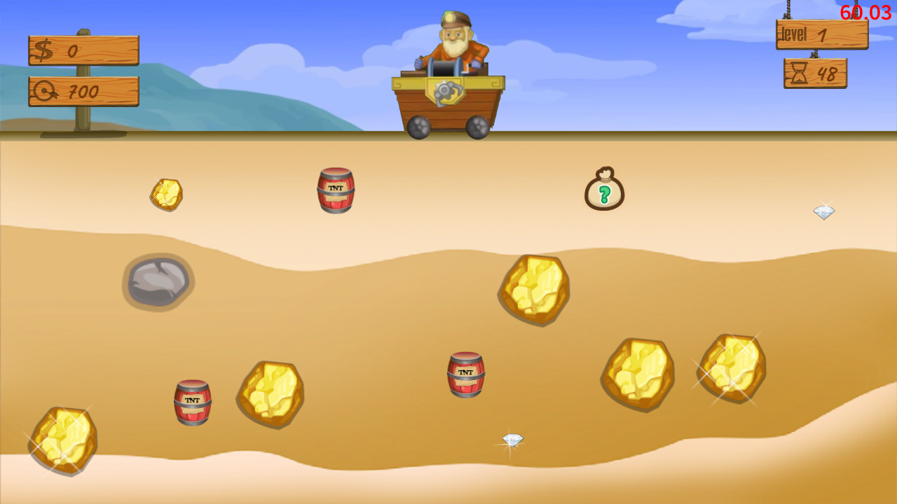
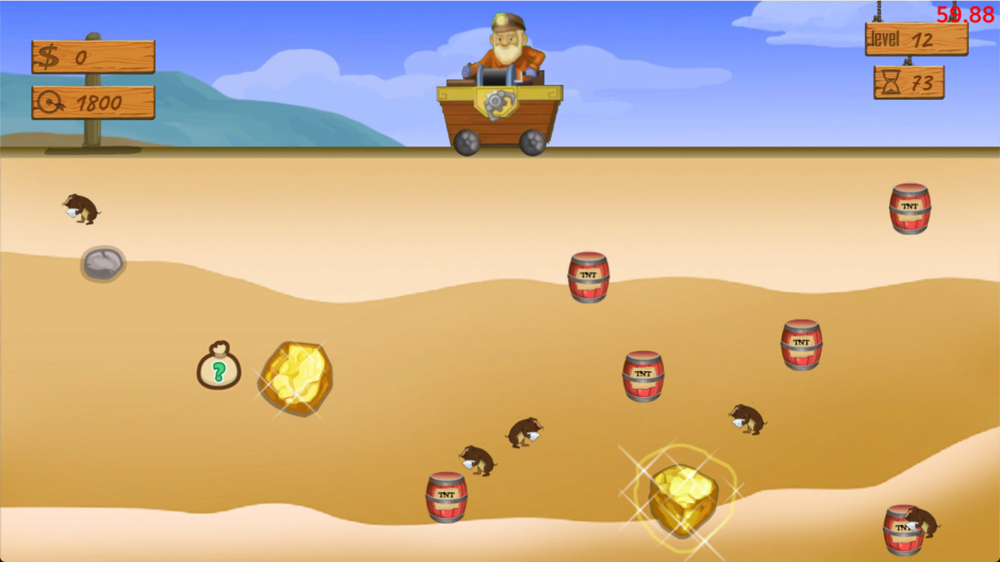
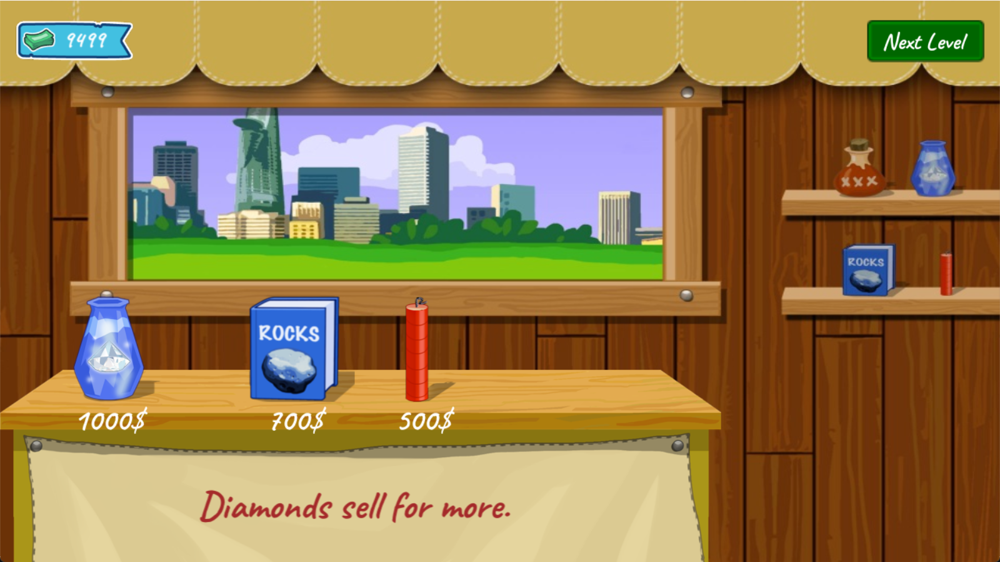
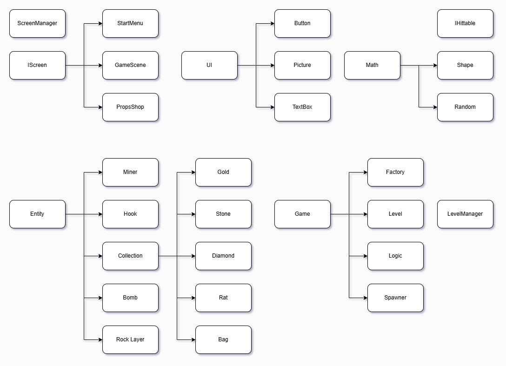

# 2025 OOPL Final Report

## 組別資訊

組別：20  
組員：林羿安  
復刻遊戲：Gold Miner

## 專案簡介

### 遊戲簡介
玩家將扮演一名挖掘黃金的礦工，利用鉤子來捕捉地下的金礦、鑽石或其他資源。隨著關卡推進，挑戰會有逐步變化，玩家需要善用策略與道具，達成每一關的目標金額。

### 組別分工
一個人一組

## 遊戲介紹

### 遊戲規則
> 遊戲玩法

* 鉤子會左右擺動，按下按鍵可發射鉤子抓取物品

* 每關有時間與金額限制，需在時間內達成目標金額

* 收集足夠金額後可提前前往商店（或等時間結束自動前往）

* 購買商店道具，提升下一關的收集效率

 

> 關卡摘要

| 關卡 | 特色 |
| :--: | :-- |
| **1~5** | 基於原版設計的關卡，取消礦工移動功能，體驗純粹的黃金礦工 |
| **6~10** | 會出現大量的石頭和岩石層妨礙玩家，需要透過商店購買的炸藥把岩石層炸開 |
| **11~15** | 目標金額大幅提高，要多利用炸藥桶炸走老鼠，收集掉落的鑽石滿足目標金額 |

 

> 按鍵說明

### `遊戲場景`

| 鍵位 | 說明 |
| :--: | :-- |
| **Normal** ||
| <kbd>左鍵</kbd> / <kbd>Space</kbd> | 丟出鉤子，再按一次返回 |
| <kbd>A</kbd> / <kbd>D</kbd> | 控制礦工左右移動 |
| <kbd>F</kbd> | 達成金額目標後，跳轉至商店場景 |
| <kbd>P</kbd> | 暫停遊戲 / 開始遊戲 |
| <kbd>Q</kbd> | 丟出垂直下落的炸藥，炸毀岩石層 |
| **Debug** |
| <kbd>TAB</kbd> | 跳轉至道具商店（滿金錢） |
| <kbd>Ctrl</kbd>+<kbd>R</kbd> | 重新載入當前關卡 |
| <kbd>右鍵</kbd> | 使鉤子朝向鼠標位置 |
| <kbd>←</kbd> / <kbd>→</kbd> | 切換 上一關 / 下一關 |

### `道具商店`

| 鍵位 | 說明 |
| :--: | :-- |
| **Normal** ||
| <kbd>左鍵</kbd> | 購買商品 |
| **Debug** |
| <kbd>TAB</kbd> | 跳轉至遊戲畫面(滿道具) |
| <kbd>Ctrl</kbd>+<kbd>R</kbd> | 重新刷新商品 |

### 遊戲畫面

## 程式設計

### 程式架構

### 程式技術

> 畫面切換架構

遊戲遊玩過程會有不斷切換畫面的行為，如果把每個畫面的物件都寫在同個檔案裡，會使得架構變得難以管理和維護，所以設計了IScreen介面，讓繼承IScreen的檔案都要有Init/Updata/ShutDown的功能，並設計ScreenManager運用IScreen的功能來管控畫面間的切換和釋放，同時保證同時只會有一個畫面存在。

> 實體生成邏輯

為保證新隨機生成實體位置不重疊已在場上的實體，所以會不斷重新嘗試新的位置，但這樣會導致嘗試無數次都失敗的可能，進而影響畫面的更新率，因此必須得限制嘗試次數，嘗試多次仍失敗時，應該要將實體丟進佇列等待下次嘗試，以保證實體的生成順序不會被影響 (體積越大的越容易生成失敗)

> 獨立遊戲程式邏輯

起因是在各種論壇討論是否讓遊戲運行邏輯擁有獨立運行功能，不依賴UI的顯示便可正常運作，而結論都是應該要分離，不過這樣就得設計取得遊戲邏輯的數值功能。起初是設計了指令佇列來存放當前遊戲邏輯的運行內容和狀態和狀態，遊戲畫面只需要讀取佇列然後更新UI，不過後來發現需要被更新的資料僅有兩個，所以去掉了佇列功能。

## 結語

### 問題與解決方法

由於是第一次嘗試製作逐偵執行的專案，所以一開始擬定的架構並沒有非常完整，遺漏了許多功能和問題，過程需要不斷回頭review的專案，上網尋找解決方法。光是畫面切換的功能就花了兩個禮拜時間，不斷調適過後才能決定最適合當前架構的方案，寫到後來才發現最好檢測專案架構的方式就是刻意不去思考架構一段時間，每當回頭看就會有新的想法解決架構的問題。

### 自評

| 項次 | 項目                   | 完成 |
|------|------------------------|-------|
| 1    | 這是範例 |  V  |
| 2    | 完成專案權限改為 public |  V  |
| 3    | 具有 debug mode 的功能  |  V  |
| 4    | 解決專案上所有 Memory Leak 的問題  |  V  |
| 5    | 報告中沒有任何錯字，以及沒有任何一項遺漏  |  V  |
| 6    | 報告至少保持基本的美感，人類可讀  |  V  |

### 心得

期初擬好架構後，撰寫程式的過程總會發現一些新的功能，又或是一些不容易注意到的特性，接著就覺得可能可以把一些打掉重練，架構砍了又建，原先還會怪罪框架的不完整導致架構需要變動，到後來學會能夠主動避免因為新發現而又要大改架構的能力，中間花了很多時間學習，直到現在的架構已經是想加甚麼新功能或玩法，都不需要更改先前架構的程式便可完成，這個專案的製作成果算是完成了來到大學的第一個目標。

### 貢獻比例

112590002林羿安 100%